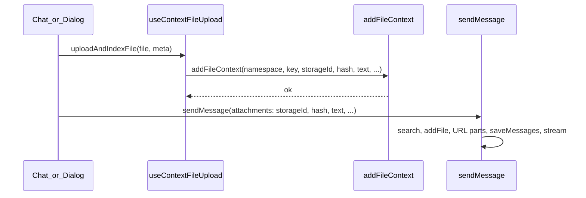

# Shared file context hook (chat + add-context dialog)

## Problem

- [`add-context-dialog.tsx`](apps/telemetry/src/routes/context/_components/add-context-dialog.tsx) and [`chat-composer.tsx`](apps/telemetry/src/routes/chat/_components/chat-composer.tsx) duplicate upload, hash, text extraction, and `addFileContext` wiring.
- Chat does not call `addFileContext` on the client today; [`sendMessage`](convex/chat/threads.ts) still runs a per-attachment `addFileContext` loop, so indexing is duplicated.

## Target architecture

- **Client** is the single place that registers files into the context system (`addFileContext`).
- **Server** [`threads.ts`](convex/chat/threads.ts) keeps search, `buildUserMessageWithFiles`, and **drops** the `addFileContext` loop.

## Placement: `routes/_hooks` (highest route scope)

All shared telemetry UI code for this feature lives under:

- [`apps/telemetry/src/routes/_hooks/context-file.ts`](apps/telemetry/src/routes/_hooks/context-file.ts) — pure helpers (no React).
- [`apps/telemetry/src/routes/_hooks/use-context-file-upload.ts`](apps/telemetry/src/routes/_hooks/use-context-file-upload.ts) — hook using `useSessionMutation` / `useSessionAction`.

Imports from feature routes look like: `import { useContextFileUpload } from "../../_hooks/use-context-file-upload.js"` (adjust depth per file), or a short alias if the project adds one later.

## 1. Shared pure helpers (`context-file.ts`)

- `isTextLikeFile(file: File)`
- `readFileText(file: File)`
- `buildContextFileKey(options: { title?: string; fileName?: string; prefix?: string })` — replaces dialog `buildKey` and server `chatAttachmentKey` (server helper removed with the loop).

## 2. Hook (`use-context-file-upload.ts`)

- `useSessionMutation(api.context.files.generateContextUploadUrl)` and `useSessionAction(api.context.files.addFileContext)`.
- Expose:
  - `uploadFileToStorage(file: File): Promise<Id<"_storage">>`
  - `prepareAttachment(file: File): Promise<{ storageId; contentHash; text?; mimeType; fileName }>`
  - `indexFileInContext(args)` — passes through to `addFileContext` (same args as [`convex/context/files.ts`](convex/context/files.ts)).

Optional convenience: `uploadIndexAndPrepare(file, { namespace, key, title, notesText? })` for chat.

## 3. Namespace for chat

Wrap chat benchmark content in [`NamespaceProvider`](apps/telemetry/src/routes/context/_hooks/use-namespace.tsx) (import provider from existing context hooks) in [`chat-page.tsx`](apps/telemetry/src/routes/chat/_components/chat-page.tsx). `ChatComposer` uses `useNamespace()` and gates on `sessionNamespaceResolved` before indexing/sending.

## 4. Refactor [`add-context-dialog.tsx`](apps/telemetry/src/routes/context/_components/add-context-dialog.tsx)

- Use shared helpers + hook; keep text-only `addContext` branch local to the dialog.

## 5. Refactor [`chat-composer.tsx`](apps/telemetry/src/routes/chat/_components/chat-composer.tsx)

- Use hook; for each file before `sendMessage`, `prepareAttachment` + `indexFileInContext` with keys from `buildContextFileKey` (e.g. prefix `chat`).

## 6. Backend [`convex/chat/threads.ts`](convex/chat/threads.ts)

- Remove the `addFileContext` `for` loop and `chatAttachmentKey`.

## Files to touch

| Area | Files |
|------|--------|
| New | `apps/telemetry/src/routes/_hooks/context-file.ts`, `use-context-file-upload.ts` |
| Chat | `chat-page.tsx`, `chat-composer.tsx` |
| Context | `add-context-dialog.tsx` |
| Convex | `threads.ts` |
